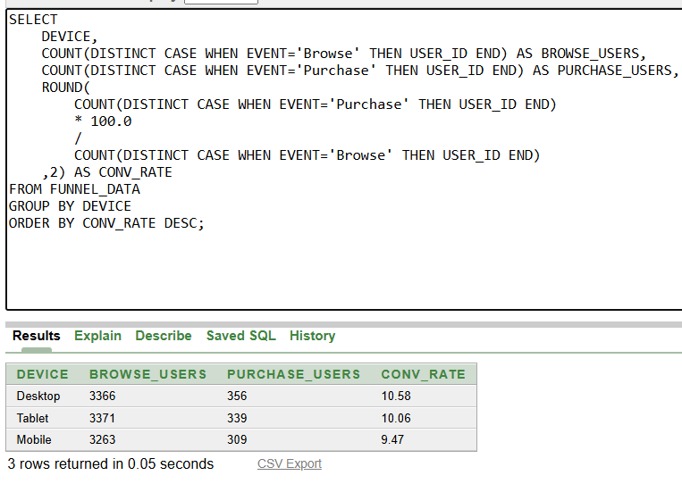
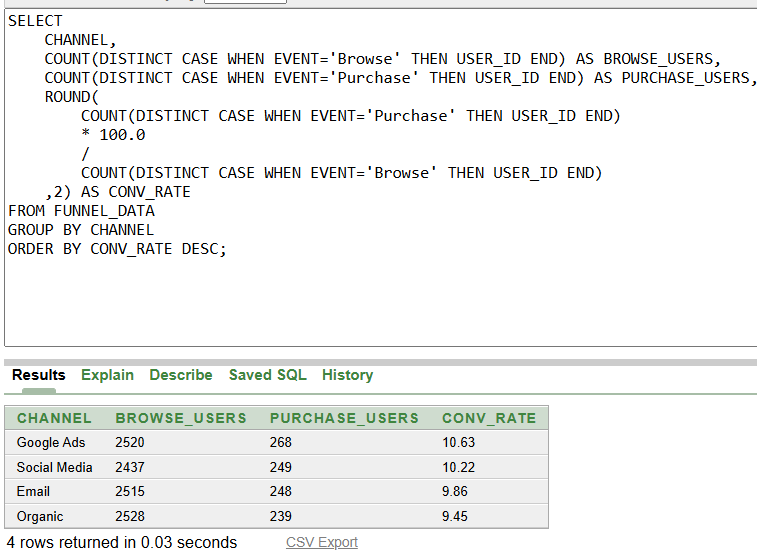

# E-commerce Funnel Analysis using SQL

## Project Overview

This project analyzes customer behavior across an e-commerce conversion funnel using Oracle SQL.

The objective is to identify user drop-off points, measure conversion rates, and evaluate performance across devices, channels, regions, and product categories. The analysis helps uncover bottlenecks in the customer journey and provides insights for improving conversion performance.

---

## Dataset Source

Dataset sourced from Kaggle:

https://www.kaggle.com/datasets/dhruvkp07/funnel-analysis-dataset

### Dataset Summary

* Total Records: 21,409
* Funnel Stages:

  * Browse
  * Add to Cart
  * Checkout
  * Purchase

### Columns Included

* User ID
* Session ID
* Event
* Device
* Region
* Channel
* Product Category
* Revenue
* Bonus Flag

---

## Business Questions

1. What is the overall funnel conversion rate?
2. Which funnel stage experiences the highest drop-off?
3. Which device has the highest conversion rate?
4. Which marketing channel performs best?
5. Which region converts best?
6. Which product category has the highest conversion rate?

---

## SQL Techniques Used

* CASE WHEN
* COUNT(DISTINCT)
* GROUP BY
* ORDER BY
* Aggregate Functions
* Data Quality Checks
* Conditional Aggregation

---

## Data Quality Checks

* Checked for null values
* Checked for duplicate records
* Investigated Bonus_Flag distribution
* Verified funnel stage counts

---

## Key Findings

### Funnel Performance

| Stage       |  Users |
| ----------- | -----: |
| Browse      | 10,000 |
| Add to Cart |  6,949 |
| Checkout    |  3,456 |
| Purchase    |  1,004 |

**Overall Conversion Rate:** 10.04%

### Funnel Drop-Off Rates

| Stage Transition       | Drop-Off Rate |
| ---------------------- | ------------: |
| Browse → Add to Cart   |        30.51% |
| Add to Cart → Checkout |        50.27% |
| Checkout → Purchase    |        70.95% |

The highest customer loss occurred between Checkout and Purchase stages.

### Device-wise Conversion Analysis

* Desktop: 10.58%
* Tablet: 10.06%
* Mobile: 9.47%

**Best Performing Device:** Desktop

---

### Channel-wise Conversion Analysis

* Google Ads: 10.63%
* Social Media: 10.22%
* Email: 9.86%
* Organic: 9.45%

**Best Performing Channel:** Google Ads

---

### Region-wise Conversion Analysis

* South: 10.54%
* North: 10.27%
* West: 9.73%
* East: 9.62%

**Best Performing Region:** South

---

### Product Category Conversion Analysis

* Electronics: 11.16%
* Fashion: 10.54%
* Sports: 9.70%
* Beauty: 9.45%
* Home: 9.30%

**Best Performing Category:** Electronics

---

## Files

* `funnel_analysis_queries.sql` — Complete SQL analysis queries
* `README.md` — Project documentation
* `screenshots/` — Analysis output screenshots

---

## Conclusion

The analysis revealed an overall funnel conversion rate of 10.04%, with the largest drop-off occurring between Checkout and Purchase stages (70.95%).

Desktop users demonstrated the strongest conversion performance, while Google Ads emerged as the highest-converting acquisition channel. The South region and Electronics category achieved the best conversion rates among their respective segments.

These findings highlight opportunities to optimize the checkout experience, reduce purchase-stage abandonment, and improve customer progression through the conversion funnel.
